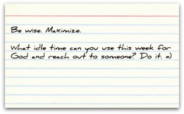

## One Verse

## One Point

> We shouldn't be afraid of failure. Instead, we should be afraid of being successful at the things that don't matter.
>
> <cite>Unknown</cite>

Have we maximized our time? Have we taken every opportunity God has given us? Or have we let our days become consumed with things that don't matter?

## One Application

