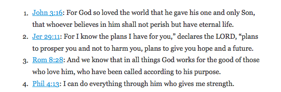
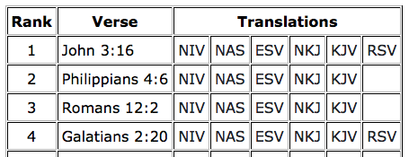

One of the road blocks I've hit when it comes to memorizing Bible verses is coming up with which verses to memorize. Sure, I usually have a couple verses at any given time that are meaningful to me, so those are a great starting point. But after that, I usually draw a blank and then quit. ;)

To not let that happen anymore, I decided to compile a list of memory verses.

Now whenever I need a verse to memorize, I can skim through this collection and see which I want to use.

So whenever you're looking for the next weekly memory verse, just hit up one of these sites!

### [Fighter Verses](https://www.fighterverses.com)

> The Fighter Verses focus on:
>
> 1.  the character and worth of our great God
> 2.  battling against our fleshly desires
> 3.  the hope of the Gospel

This is the jackpot of all things Scripture memory. Here you'll find a collection of 260 verses (one every week for five years). Each verse is categorized so you can target memory verses based on cool stuff like God's faithfulness, being patient, battling temptation, etc.

Not only that but they have an iPhone/Android app you can use to review and quiz yourself on the verses.

I told you it was the jackpot. ;)

### [Topical Memory System](http://www.navigators.org/us/resources/illustrations/items/Topical%20Memory%20System)

> If you want to memorize Scripture, but aren't sure what to memorize or how, this system is exactly what you need to begin hiding God's word in your heart.

Created by the Navigators, the [Topical Memory System](http://www.navigators.org/us/resources/illustrations/items/Topical%20Memory%20System) is a popular collection of 60 verses categorized into five main categories (with sub-categories).

### [The 100 Most-Read Bible Verses](http://www.biblegateway.com/blog/2009/05/the-100-most-read-bible-verses-at-biblegatewaycom)

> What are the most popular Bible verses on BibleGateway.com?
>
> We thought it would be interesting to find out, so we crunched some numbers from a (relatively) small sample of 25 million Bible passage searches from March and April.

Bible Gateway published a list of the [100 most-read Bible verses](http://www.biblegateway.com/blog/2009/05/the-100-most-read-bible-verses-at-biblegatewaycom/) on their blog back in 2009. This list represents a great collection of Scripture worth memorizing. Most of them are very encouraging and/or provide great reminders about the promises/character of God.

### [Top Bible Verses](http://www.topverses.com/?&pg=1)

> The Top Verses team has analysed thousands of pages of teaching material to determine the most frequently referenced Bible verses.

Check out their [top Bible verses](http://www.topverses.com/?pg=1) for the most referenced verses from 1 to 31,105!

### [Top 100 Memory Verses](http://www.memverse.com/popular)

> This is a list of the most popular bible verses that users are memorizing on Memverse.

Memverse is an online tool used to help memorize Scripture. They've published a list of the [top 100 memory verses](http://www.memverse.com/popular) submitted by their users.

### [Top Verses to Memorize](https://www.bible.com/reading-plans/40-top-verses-to-memorize)

> Do you want to memorize scripture? Where do you start? We have compiled some of the top verses people memorize and consistently resort to from all the books of the Bible.

### Other Memory Verses

-   [Successful Scripture Memory and Review](http://www.spurgeongems.org/bmg.htm)
-   [Top 100 Bible Memory Verses](http://scripturetyper.com/memory-verse-library/)

### Final Words

I leave you with some final words from [John Piper and others](http://www.desiringgod.org/resource-library/taste-see-articles/why-memorize-scripture) who have spent a lifetime mediating on God's Word.

> Bible memorization is absolutely fundamental to spiritual formation. If I had to choose between all the disciplines of the spiritual life, I would choose Bible memorization, because it is a fundamental way of filling our minds with what it needs.
> ~Dallas Willard

> I know of no other single practice in the Christian life more rewarding, practically speaking, than memorizing Scripture. . . . No other single exercise pays greater spiritual dividends! Your prayer life will be strengthened. Your witnessing will be sharper and much more effective. Your attitudes and outlook will begin to change. Your mind will become alert and observant. Your confidence and assurance will be enhanced. Your faith will be solidified.
> ~Chuck Swindoll

> If we would be changed into Christ likeness we must steadily see him. This happens in the word. […] Bible memorization has the effect of making our gaze on Jesus steadier and clearer.
> ~John Piper

If you have any other collection of verses, please let me know in the comments!
