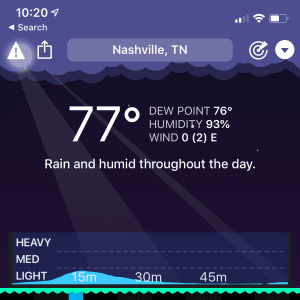
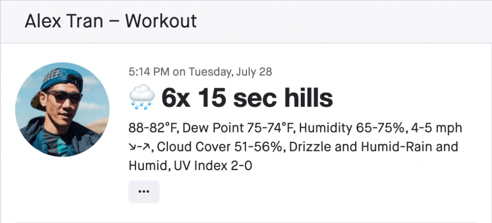

For runners or any outdoor enthusiast, the dew point is a far more insightful metric than relative humidity (commonly referred to as just humidity).

**Contrary to popular belief, the humidity doesn't tell you how comfortable it'll feel outside, the dew point does!**

Knowing the dew point helps you mentally set the right expectation for a run, determine what to wear, and guide hydration/cooling decisions.

Before I share why the dew point is more useful than humidity, it'll help to understand a bit more about humidity.

It's nuances often lead to misinterpretation.

## The Downsides of Humidity

### Humidity Can Be Deceptive

What runners interpret as high humidity isn’t always the case.

For example, 90°F (32°C) at 60% humidity will feel pretty humid outside. When the temperature is hotter, it’s not uncommon for people to say the humidity is really high even though the actual percentage is relatively moderate.

What they're really feeling is a higher dew point. 🤯

### Humidity Is Not Useful by Itself

You might see 100% humidity and think to yourself, “That stinks. It’s going to feel really muggy outside.” But that percentage alone doesn't tell you anything useful.

**For humidity to be helpful, you also need the temperature.**

Consider these examples:

|  | Temp (°F) | Temp (°C) | Humidity (%) | How It Feels |
| --- | --- | --- | --- | --- |
| **Example A** | 55 | 13 | 100 | Crisp and comfortable |
| **Example B** | 75 | 24 | 100 | Humid and muggy |

Both temperatures have the same humidity, but they feel drastically different.

For humidity to be useful, you need a lookup table that shows what it'll feel like at different temperature/humidity pairs. As you’ll learn later, that’s unnecessarily complicated compared to the dew point.

### The Root Reason

While I’ve been referring to relative humidity as just humidity, the two primary downsides above are because of the word “relative.”

Humidity tells you how much moisture is in the air _relative_ to how much the air can hold. So when the humidity is at 100%, that means the air is saturated with moisture and can’t hold any more. If it’s at 50%, the moisture “glass” is half full (or half empty? 🤷🏻‍♂️).

And a critical characteristic of humidity is: The higher the temperature, the more moisture the air can hold.

This explains why Example B above feels muggier. At the same humidity, the higher temperature means there's more moisture in the air compared to a lower temperature.

This is what makes humidity deceptive.

**The relative nature of humidity is what makes it hard to interpret.**

What we really want to know before heading outside is the _absolute_, not _relative_ amount of moisture in the air. That’s what determines how muggy or humid the air will feel.

And that, my friend, is where the dew point swoops in and saves the day.

## The Upsides of Dew Point

**The dew point tells you how much moisture is in the air which easily translates into how it’ll feel outside.**

Unlike humidity, dew point is an _absolute_ measure, not _relative_.

A 50°F (10°C) dew point will always feel comfortable outside regardless of the temperature or humidity. Whereas a 50% humidity will feel different depending on the temperature.

This is why the dew point is so much more useful than humidity.

It’s “portable.” You just need one number. And it’s practical. No big lookup tables needed.

All you need is this table (which is easily memorized) …

## Comfort Levels at Various Dew Points

<figure id="dew-point-gradient">

| Dew Point (°F) | Dew Point (°C) | How It Feels |
| --- | --- | --- |
| \> 75 | \> 24 | Extremely uncomfortable |
| 70–74 | 21–23 | Very uncomfortable |
| 65–69 | 18–21 | Moderately uncomfortable |
| 60–64 | 16–18 | Slightly uncomfortable |
| 55–59 | 13–15 | Comfortable |
| 50–54 | 10–12 | Very comfortable |
| 32–49 | 0–9 | Comfortable but with drier air |
| < 32 | < 0 | Comfort varies (At lower values, the air could be too dry for some.) |

<figcaption>How it feels at various dew point ranges.</figcaption>
</figure>

**Since comfort is subjective, use the table above as a starting point.**

If you live somewhere more hot and humid, the 60–64°F (16–18°C) range might actually feel comfortable to you whereas someone used to cooler and drier conditions might consider it moderately uncomfortable.

The key is making note of the dew point ranges that feel comfortable and uncomfortable to you and making decisions based on those ranges.

And one disclaimer ... a dew point in the comfortable range doesn't mean performance is unaffected. Higher temps with lower dew points can affect performance just like lower temps with higher dew points.

## How Do I Use Dew Point Before a Run?

With a little practice, it won’t take long before you’ll be able to tell how comfortable (or uncomfortable) a run will be from just the dew point.

Note, the following also applies when running in hotter temperatures.

### Stay Cool

As the dew point gets higher and more uncomfortable, it’s much harder for the body to cool itself. A higher dew point means more moisture in the air which makes it harder for sweat to evaporate and create a cooling effect.

So here are some other ways to help with cooling with higher dew points:

- Choose a route with more shade.

- Wear technical, sweat-wicking clothes.

- Wear a hat soaked in cold water.

- Drink more water or sports drink per hour.

- Adjust power/pace targets based on the weather.

The last point is worth reiterating, especially for long runs or higher intensity efforts.

**If the temperature or dew point is higher than your typical training conditions, you should adjust your power/pace targets accordingly.**

This ensures you’re running at the correct effort.

A half marathon tempo workout isn’t training the right physiological system if it feels like a 10k effort. It’s so important to adjust targets based on the weather for these reasons:

- Your body gets the right stimulus.

- You don’t over exert yourself.

- You reduce the risk of injury (by not running harder than you should given the conditions).

If you run by power, use [SuperPower Calculator for Sheets](/superpower-calculator/) (SPCs) to adjust for environmental conditions (including elevation). If you run by pace, try the [Temperature Calculator from RunnersConnect](https://runnersconnect.net/training/tools/temperature-calculator/).

### Train Your Brain and Body

I think there’s also an element of training yourself mentally when the dew point or temperature gets into the uncomfortable range. And learning to embrace those runs instead of dreading them.

You’re not always guaranteed ideal weather on race day, so it helps to frame running in uncomfortable conditions as practice for less-than-ideal race conditions.

If you show up in training, you’ll show up on race day.

Another thing that helps is knowing these runs help your body adapt to the heat.

**With 2–3 weeks of running in conditions with higher dew points and/or temperatures, your body becomes more efficient at cooling itself.**

And the more you run in those conditions, the longer your body stays heat-adapted.

### Appreciate the Little Things

If the dew point is in your comfortable range, there’s nothing to change in your normal running routine. Maybe just go out and appreciate the run a little more knowing why it feels so comfortable outside—the lower dew point! 💪🏻

## Where to Get the Dew Point

Most websites and apps display the dew point if you look for a detailed view of the current forecast. All of the apps/websites below include it.

**Websites**

- [The Weather Channel](https://weather.com/)

- [Weather Underground](https://www.wunderground.com/weather/us/tn/nashville)

- [AccuWeather](https://www.accuweather.com/)

**iPhone Apps**

<figure>

<figcaption>

The dew point in CARROT Weather. I give it top priority after the temperature.

</figcaption>

</figure>

Unfortunately, the default weather app on iOS doesn't display the dew point. ? But that's okay because there's plenty of better options!

- [CARROT Weather](https://www.meetcarrot.com/weather/) (free + optional subscription)

- [Hello Weather](https://helloweatherapp.com/) (freemium)

**Android Apps**

Weather from the Google Assistant shows the dew point, however, here are some app alternatives:

- [CARROT Weather](https://www.meetcarrot.com/weather/) (free + optional subscription)

- [Hello Weather](https://helloweatherapp.com/) (freemium)

- [Today Weather](https://todayweather.co/) (freemium)

## Practice Dew Pointing

With your newfound knowledge, I recommend you look at the dew point before going outside and see how that translates to your comfort.

Make a mental note of what ranges feel comfortable/uncomfortable.

**And just for fun, I like to play a game.** When I walk outside, I'll gauge my comfort level and try to guess the dew point within five degrees Fahrenheit (two degrees celsius).

Anyway, as you get a feel for different dew points, I hope you'll see the value of it and become #teamdewpoint!

## Bonus #protip

**If you’re a Strava user, I highly recommend you connect [Klimat.app](https://klimat.app/) to your account.** It’ll automatically add the weather to each of your activities for free.

Unfortunately, the free plan doesn’t include the dew point. However, IMHO, it’s worth the $5 USD per year to customize the output and add the dew point (among other useful features).

Even if you don't pay for Klimat, you can still [calculate the dew point from the temperature and humidity](https://www.omnicalculator.com/physics/dew-point).

<figure>

<figcaption>

My Klimat weather summary. **Note**: I have Klimat output starting and ending weather for activities longer than 75 minutes (a feature of the paid version).

</figcaption>

</figure>
