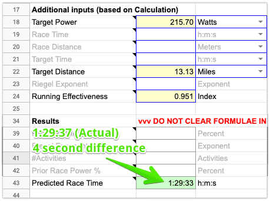
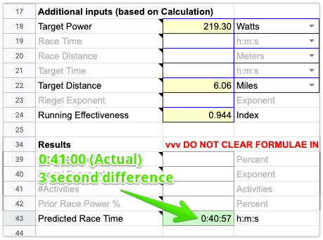

Not to be confused with running economy or running efficiency, running _effectiveness_ measures how effective a runner is at converting power to speed.

\[latex display="true"\]\\text{Running Effectiveness (RE)} = \\frac{\\text{speed (in m/s)}}{\\text{power (in W/kg)}}\[/latex\]

RE can be calculated in various analytics platforms like [WKO](https://www.trainingpeaks.com/wko5/), [Golden Cheetah](https://www.goldencheetah.org/), [Today's Plan](https://www.todaysplan.com.au/), or the [SuperPower Calculator](/spc/).

> The second most important metric in running with power: Running Effectiveness.
>
> Steve Palladino ([The Palladino Power Project](https://www.facebook.com/groups/PalladinoPowerProject/))

RE's utility is primarily found in race planning and post-run analysis.

With race planning, a good understanding of your RE at various intensities will help establish race-day power targets and accurately estimate finish time. Shockingly accurate, in fact.

Below are some example races I've done across different distances.

Notice how just using average power, distance, and RE predicted finish times within seconds of the actual finish times.

<figure>

    

    <figcaption>

    Half Marathon (4 seconds off)

    </figcaption>

    </figure>

<figure>

    

    <figcaption>

    10k (3 seconds off)

    </figcaption>

    </figure>

<figure>

    

    <figcaption>

    5k (1 second off)

    </figcaption>

    </figure>

To understand RE's utility in post-run analysis, it's beneficial to understand things that impact RE:

- Intensity
- Elevation grade
- Wind
- Level of fatigue

In general, the higher the intensity, the higher the RE. For example, RE will be higher at 5k effort versus marathon effort. The only exception might be at intensities above critical power where a slight decline in RE could occur. For elevation grade, wind, and level of fatigue, the higher those things, the lower RE will be (and vice versa). So running up a hill, into a headwind, or when tired will result in lower REs.

These characteristics make running effectiveness useful as both a summary metric (i.e. over an entire run) and drilling down into specific laps, intervals, or user-defined segments.

One thing to definitely keep an eye on is your RE at different race intensities (e.g. 5k, marathon, etc.). Specifically, looking at durations over 10 minutes.

What is it on flat surfaces? What is it on routes of varying elevation gain/loss?

This will drastically aid in race-day power planning.

Comparing RE over similar intensities and routes (using the same device) is also tangible way of seeing if you're running more effectively.

Since there's a wind/non-wind version of [Stryd](https://www.stryd.com/) and other running power meters on the market, it's worth mentioning RE should only be compared across the same device. Each records power values differently at the same intensity, so comparing RE values from different devices isn't possible.

## Additional Reading

- [Understanding Running Effectiveness and its Uses](https://docs.google.com/document/d/e/2PACX-1vTzjH-Ns_GInUm4lAxi3cVOQpzzKcWNF6VEX271s-QGYFHjwMgyLhhmu5i21-1_CaC3eL0B817rQo8k/pub)
- [Running Effectiveness versus Speed Using WKO4](https://www.trainingpeaks.com/blog/running-effectiveness-versus-speed-using-wko4/)
