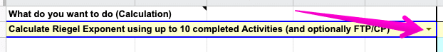
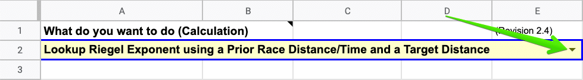
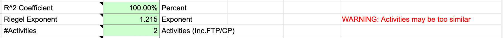

<link rel="stylesheet" href="https://cdn.jsdelivr.net/npm/katex@0.16.4/dist/katex.min.css">

The SuperPower Calculator (SPC) contains a comprehensive suite of calculators and converters useful to anyone training, racing, and running with power.

There are two versions: SPC for Web (SPCw) and SPC for Sheets (SPCs). The Sheets version is the original and provides the most calculations while SPCw offers the most common calculations. For more information about SPCw, please visit the [SPCw page](https://superpowercalculator.com/).

Some of the more common SPCs features include:

- Calculating FTP/CP

- Calculating race target power

- Evaluating "what if" scenarios

- Adjust power target based on altitude, temperature, and humidity

See below for [a list of all supported calculations](#supported-calculations).

## Getting Started

SuperPower Calculator requires a Google Account. If you don’t have one, please [create one beforehand](https://accounts.google.com/signup).

**Note**: During sign up, you can use an existing email address as a Google Account. Creating a separate Gmail email address isn’t required.

## Step 1: Make a Copy

Make sure you're signed into your Google Account and then [open the SuperPower Calculator (SPC)](http://f1r2a.com/SuperPower_Calculator). It will prompt you to make a copy.

Since the SPC is updated periodically, it's a good idea to make a copy regularly using that link to ensure you're using the latest version.

## Step 2: Choose a Calculation

At the top of the `MAIN` sheet, click the arrow in the yellow cell under the `What do you want to do (Calculation)` cell.

In the dropdown that appears, choose a calculation.

## Step 3: Follow the Instructions in the Next Steps Section

Depending on the calculation, some of the sections below will be displayed. Fill out all required and optional (where appropriate) fields listed in each section.

Yellow cells are required. Blue cells are optional.

- `Basic Data`: Fields used for most calculations.

- `Additional Inputs`: Additional fields used in the chosen calculation.

- `Environment Adjustments`: SPC can apply environment adjustments (altitude, temperature, and humidity) to almost all calculations. The field names will change to provide more context depending on the selected calculation.

- `Results`: Shows the results for the chosen calculation. Green cells are the results.

Depending on the selected calculation, the Next Steps section may direct you to one of these other tabs:

- `Activities (Landscape/Portrait)`: Used in calculations requiring multiple activities. Pick one or the other depending on layout preference.

- `Scenarios`: Used for calculating race target power based on different RE and Riegel pairs or RE and Reserve Work Capacity (RWC).

- `Riegels`: Used to lookup a Riegel exponent using a previous race distance and time.

- `RE (CVI)`: Used to lookup an RE-adjustment factor based on CVI.

- `RWC (W')`: Used to compare your Reserve Work Capacity or W' to other runners.

- `Zones`: Used for various P3 zone calculations.

## Supported Calculations

### Calculate CP/FTP

- Calculate FTP/CP and RWC (W') from a CP test

- Calculate FTP/CP from a Prior Race Power/Time and Riegel Exponent

- Calculate FTP/CP and RWC (W') using maximal efforts from different days

When using maximal efforts across different days, one activity should be < 6 minutes and another > 15 minutes. All activities should be between 2-40 minutes.

See [Using the](#activities-tab) `[Activities](#activities-tab)` [Tab](#activities-tab) for more information on ensuring valid and accurate calculations.

### Race Power Planning

- Generate Race Power Scenarios using pairs of Riegel Exponents and Running Effectiveness

- Generate Race Power Scenarios using FTP/CP, RWC (W') and Running Effectiveness

- Calculate Race Target Power from a Prior Race, Target Time and Riegel Exponent

- Calculate Race Target Power from a Prior Race, Target Distance and Riegel Exponent

- Calculate Race Target Power using FTP/CP, Target Time and Riegel Exponent

### What If

- Given my current FTP/CP, what % FTP/CP improvement do I need to break y:yy?

- Calculate Race Target Power using Target Distance, Time and Running Effectiveness

- Calculate Estimated Race Time using Target Distance, Power and Running Effectiveness

### Other Functions

- Adjust Power, Air Power or FTP/CP based on Altitude/Temperature/Humidity

To adjust FTP/CP based on environment, choose `FTP/CP` as the unit of measure for the Power field.

- Calculate Power metrics (RE, HPR, LSS/kg, CVI, etc.) for up to 10 Activities

- Lookup Riegel Exponent using a Prior Race Distance/Time and Target Distance

- Lookup RE Adjustment using Prior CVI and Target CVI

- Lookup RWC Rating based on Gender and Power Meter

- Calculate Zones from FTP/CP; Lookup %FTP or Wattages; Calculate Zone.Decimals

### Advanced Functions

- Calculate Riegel Exponent using up to 10 completed Activities (and optionally FTP/CP)

## Key Concepts

### FTP/CP

In simple terms, it represents your current fitness and is measured in watts (W) or watts per kilogram (W/kg).

Functional threshold power (FTP) and critical power (CP) can be used interchangeably in a running context. So where you see FTP used, CP can be used or vice versa.

**Further Reading**: [What is Critical Power (CP)?](/key-concepts/critical-power/)

### Time to Exhaustion (TTE)

TTE measures how long a person can maintain their FTP/CP before fatiguing. It can vary greatly from runner to runner (e.g. 30-75 minutes). If you don’t know your TTE, power-based calculations use 50 minutes as the default.

Despite 50 minutes not being accurate for all runners, the difference is small enough to not significantly impact power targets.

**Further Reading**: [Running Functional Threshold Power - A Primer](https://docs.google.com/document/d/e/2PACX-1vT2ucrcwUlitpfi6qFkU9URQSy5GVBQknsKvLf7iLDJBqW7g-jc3k01JkygYib7YhoWK874Q9fWKlt_/pub).

### Running Effectiveness (RE)

Not to be confused with running economy or running efficiency, running effectiveness measures how effective a runner is at converting power to speed.

RE’s utility is primarily found in race planning and post-run analysis.

**Further Reading**: [What is Running Effectiveness (RE)?](/key-concepts/running-effectiveness/)

### Riegel Exponent (Fatigue Factor)

A runner’s fatigue factor can help predict finish times based on a known race time or critical power. It measures how much a runner fatigues over increased distances and is a key part of good race power planning.

Assume two runners with identical 5k PRs run the same marathon. Everything else equal, the runner with the lower fatigue factor will have the faster marathon time.

In other words, the lower the fatigue factor, the less a runner will slow down over increased distances.

**Further Reading**: [What is a Fatigue Factor (i.e. Riegel Exponent)?](/key-concepts/fatigue-factor/)

For calculations requiring a Riegel exponent, there are a few different approaches:

1. If known, specifying a Riegel exponent directly.

3. Use the `Lookup Riegel` feature.

5. Use the `Advanced: Calculate Riegel Exponent using up to 10 completed Activities (and optionally FTP/CP)` calculation.

For most users, Option #2 is recommended. It can be done in two different ways:

1. Choose `Lookup Riegel Exponent using a Prior Race Distance/Time and a Target Distance` from the calculation dropdown.

2. Select the `Lookup Riegel` option from the dropdown in any calculation requiring a Riegel exponent.

Depending on the calculation, you will need to specify other required fields.

When using Option #3, please make note of the following:

- See [Using the](#activities-tab) `[Activities](#activities-tab)` [Tab](#activities-tab) for more information on ensuring valid and accurate calculations.

- To calculate a Riegel Exponent using FTP/CP, choose `TRUE` in the row labeled `Include FTP/CP and TTE`? at the bottom of the Activities tab.

### Reserve Work Capacity (RWC)/W'

Reserve work capacity (RWC) is a new term introduced by SPC to more accurately describe W' (work above threshold) or anaerobic work capacity (AWC).

RWC is the amount of work you can do above CP/FTP before fatiguing. Think of RWC like a battery. It has a certain capacity before it completely drains. The higher your RWC, the longer you're able to hold a specific power above CP/FTP.

Assuming accurate values for CP/FTP and RWC, race planning may be more accurate using RWC over a Riegel exponent for races above CP/FTP.

Assuming accurate values for CP/FTP and RWC, race planning may be more accurate using the `Generate Race Power Scenarios using FTP/CP, RWC (W') and Running Effectiveness` function than the other Riegel-based calculators for races shorter than 50 minutes or TTE at CP/FTP.

### Altitude, Temperature, and Humidity (Environmental Conditions)

Environmental conditions (e.g. altitude, temperature, and humidity) impact an athlete’s ability to generate and maintain specific power levels. For example, running at 100% FTP is significantly easier under cool conditions versus hot, humid conditions at a higher altitude.

SPC incorporates Stryd’s [Race Power Predictor](https://docs.google.com/spreadsheets/d/1KU9U6QdjWlvmsQXVsCj1AnKEzywNL0Hq5yXIwOcYLF8/view) to normalize activities taking place in different environments (i.e. a race with conditions different than your typical training environment).

This ensures proper effort is targeted under different conditions.

### Air Power and Running Power

Stryd Wind includes the power needed to overcome air resistance and headwinds in the total power measurement. It calculates total power ($P_t$) by adding air power ($P_a$) and running power ($P_{rc}$).

$$ P_t = P_a + P_{rc}$$

SPC supports entering air power in watts, watts/kg, or as a percentage of total power. Combined with adjustments based on environmental conditions, the adjusted running power ($P_{rc}$) can be used to convert an outdoor power or CP/FTP into the equivalent on a treadmill where air resistance ($P_a$) is not a factor.

### Using the `Activities` Tab

For calculations requiring the `Activities` tab, you may see a warning in the `Results` section of the `MAIN` tab.

The warning is shown when the calculation can’t produce a result or produces an inaccurate one (using linear regression).

For more accurate results, make sure you follow these guidelines:

1. Activities should have varied durations. Using similar durations will over or underestimate results.

3. Activities should be maximal (or near maximal) efforts. Sub-maximal efforts will underestimate results.

5. When calculating a Riegel exponent, at least one of the activities should be a similar distance to the planned race distance. If one isn’t available, use one as close as possible. For a marathon, even a 10k activity would produce much better results than activities at shorter distances.

7. Activities with shorter durations should have higher power values than those at longer durations.

## [Walkthrough Videos](https://www.youtube.com/playlist?list=PLn_-H5VMWQwWWId6LmXf0nddXULASaKfD&fbclid=IwAR0BdlW-d1pWLEcUuHHGFlL-U0r4SJYyP01PrEP804r4rDvz6FtJGTW6Yjc)

## Changelog

### 4.0

- Calculation of Race Power Scenarios using your FTP/CP, Reserve Work Capacity (RWC) and your Running Effectiveness. This calculation is targeted at races lasting 50 minutes or less (normally run at wattages above FTP/CP).

- Two different FTP/CP calculations: the first aimed at calculating from a CP test; the second aimed at calculating using maximal efforts from activities taking place over a two-week period. The second has been added to better guide inputs to the FTP/CP calculation outside of a CP test.

- Grouping the calculations into four groups: Calculating FTP/CP; Race Power Planning; Other; Advanced. This should make calculations easier to find.

- Addition of a Portrait orientation Activities tab for use on devices that can’t easily handle the existing Landscape orientation.

- Lookup using the Course Variability Index (CVI) table to apply an appropriate adjustment to your entered Running Effectiveness. This should enable CVI-based RE adjustments to be included in calculations of race target power or estimated time.

- A reference table that can be used to “rate” your Reserve Work Capacity (RWC) based on Gender and Power Meter, and that SPCs can use to improve detection of invalid or suspect RWC values.

- Calculation of Course Variability Index + Net Elevation Change (CVI+Net) which complements the existing CVI calculation for courses that are “net downhill” or “net uphill”.

- Calculation of FTP/CP (from maximal effort activities) incorporating environmental and Air Power (Pa) adjustments. This enables the impact of differing Air Power, altitude, temperature and humidity to be assessed using a single calculation and can be used to obtain FTP/CP values applicable to: a typical training environment; a treadmill environment; the environment expected at an upcoming race.

- Calculation of an adjusted Stryd Weight that can be used to compensate for the impact of differing Air Power, altitude, temperature and humidity without adjusting FTP/CP values or training targets (instead, by adjusting your Stryd Weight on your footpod).

- Addition of an “Ultra?” toggle that adjusts some of the range checks to allow for longer distances and times.

- Addition of a “Show me” toggle on the Main and Activity tabs to show Power values in Watts, Watts/kg or as a ratio of Total Power, and to show RWC (W’) in KiloJoules or in Joules/kg.

- Adjusting the color scheme to one that should be more usable by people with different types of color-blindness.

- Addition of “ClickFor ...” links offering direct access to basic and advanced videos that explain how to use each calculation.

- Various other adjustments and fine-tuning based on feedback posted in the facebook groups.

New and Adjusted features are shown in SPCs using ● (for new) and ◊ (for adjusted) prefixes (until 31 May).

## Credits

SuperPower Calculator is a collaboration between:

- Steve Palladino ([Palladino Power Project](https://www.facebook.com/groups/PalladinoPowerProject/))
- Steve Bateman ([from1runner2another](https://www.facebook.com/groups/from1runner2another/))
- [Alex Tran](/)
- Mikael Lönn

With kind permission from the [Stryd Team](https://www.facebook.com/groups/strydcommunity/) to incorporate their altitude, temperature, and humidity power converter.
