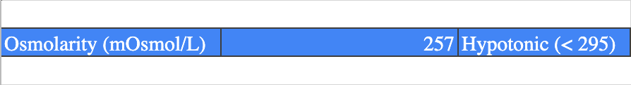

If you haven't read [How to Minimize GI Distress When Running (By Mixing Your Own Sports Drink)](/diy-sports-drink/), do that first. It provides the context you'll need to get the most out of this calculator.

**Disclaimer**: This calculator requires the use of the ingredients below. Adding other ingredients will lead to an inaccurate tonicity calculation.

- [Fructose](https://www.alextran.org/go/fructose)
- [Maltodextrin](https://www.alextran.org/go/maltodextrin)
- [Sodium Citrate](https://www.alextran.org/go/sodiumcitrate)
- [Lemon Crystals](https://www.alextran.org/go/lemoncrystals)

Outside the United States? If Amazon in your country doesn't have the same product, search for equivalents using these terms: maltodextrin powder, fructose powder, sodium citrate, or citric acid.

For the best experience, view the calculator on a computer and not a mobile device.

<iframe style="display: block; margin: 0 auto;" width="100%" height="480" frameborder="0" scrolling="no" src="https://onedrive.live.com/embed?resid=6D52A7E9EED8BDD%21116&amp;authkey=%21AAowdrvqwCJPrp4&amp;em=2&amp;wdAllowInteractivity=False&amp;AllowTyping=True&amp;ActiveCell='Calculator'!B2&amp;wdHideHeaders=True&amp;wdDownloadButton=True&amp;wdInConfigurator=True"></iframe>

### Step 1: Figure Out Your Desired Nutrition Per Hour

In the calculator above, change the orange numbers next to each ingredient with how much nutrition you want per hour.

I recommend starting with how much you're currently getting per hour from traditional sports drinks or gels. That way you're starting from something you know works with your gut.

<figure>

<figcaption>

Change the orange numbers according to your nutritional needs per hour.

</figcaption>

</figure>

**Water**  
If you're outside the United States, make sure to change the drop down from `US fluid oz` to `imperial fluid oz`.

**Carbs (Fructose)**  
Fructose serves double duty as a source of carbs and a sweetener. You should add just enough fructose to get your preferred sweetness.

**Carbs (Maltodextrin)**  
Once you have the desired sweetness from fructose, subtract the amount of fructose from the total amount of carbs you want per hour to figure out how many carbs you'll need from maltodextrin.

For example, if you want 25g of carbs per hour and are using 8g of fructose, enter 17g for maltodextrin.

**Sodium**  
How much sodium you'll need is a little more subjective.

350mg is a good starting point.

But if you're a salty sweater (i.e. salt crystals form on your skin or your sweat tastes salty) then you might want to try 500-1000mg per hour depending on the sodium concentration of your sweat.

**Lemon Crystals**  
This is a non-essential (read: optional) ingredient but does add a bit of flavoring that makes the drink taste a bit better (and less like sugar water).

It's up to you to figure out how many packets you want in your mix.

## Step 2: Enter the DE of Maltodextrin

Maltodextrin is classified by its dextrose equivalent (DE) that ranges from 3 to 20. All maltodextrin I've seen sold for food purposes has a DE of 10, so it's safe to assume that number here.

However, if you're using maltodextrin with a different DE, enter that number here as it affects tonicity.

## Step 3: Review Tonicity

Once you've specified how much nutrition you want per hour, look at the blue strip that shows osmolarity and tonicity.

<figure>

<figcaption>

Check to see if your recipe is hypotonic, isotonic, or hypertonic.

</figcaption>

</figure>

Make sure the tonicity matches what you want out of your sports drink.

- **Isotonic** (recommended): Hydration _and_ nutrition
- **Hypotonic**: Hydration over nutrition
- **Hypertonic**: Nutrition over hydration

If you want a better understanding of the pros and cons of each, [read this primer on tonicity](https://www.alextran.org/diy-sports-drink#before-you-change-the-recipe-know-this).

When adjusting the ingredient ratios, keep in mind maltodextrin impacts tonicity the least while fructose and sodium impacts it the most.

## Step 4: Mix the Drink

Look under the Serving Size column to see how much of each ingredient to mix together.

<figure>

<figcaption>

Note how much of each ingredient is required under the Serving Size column.

</figcaption>

</figure>

If you need a kitchen scale (super handy), [here's a well-reviewed one](https://www.alextran.org/go/kitchenscale).

**Pro tip**: Put an empty bottle on the scale and hit the Tare button. That resets the weight to zero (including the bottle). Then keep hitting the Tare button after each ingredient. That makes it really easy to add ingredients one after the other without having to take the drink off the scale.

I'm sure that's a common feature of all scales but it blew my mind. This is why it pays to read the instruction manual. ?

## Step 5: Keep a Journal

As you're going down this rabbit hole of trying different recipes, it's worth keeping a journal. Make note of how much you're using of each ingredient and how your body responds. Do you feel full or bloated? Are you experiencing cramps or GI distress?

You should treat it like a science experiment and **only change one thing in the recipe at a time** (e.g. the amount of fructose or sodium). If you change multiple things at a time and your body reacts poorly, you don't know which change resulted in the reaction.

Over time, a journal will give you insight into what your body can and can't tolerate.

Also know you can train your body to tolerate more carbs per hour. So if you need more carbs, find the current amount you can tolerate per hour and gradually increase it over time.

Let me know in the comments if you have any questions!
