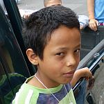

### Angela

For one of our outreaches, we went into the community of Aurora to pray for people with needs. The first stop was a woman named Angela. \<insert prayer requests here>

While we were praying for her, it was easy to see she was overwhelmed by the expression of love from the group.

All 17 of us piled into her house, laid hands on her during prayer and gave her hugs and whatever encouraging Spanish sayings we could muster before leaving.

I think Dios de bendiga (God bless you) was a popular one. ;)

### Serena

After praying for Angela, the next stop was a women named Serena.

Serena had been bed-ridden for the past five years with complications with her stomach. Again we packed as many people as we could around her bed and began to pray with her.

The presence of God in that room was thick.

But the party only just started. After everyone was done praying, the group started to funnel out of the house. About this time Serena began to speak. Lauren, our translator, said something along the lines of “that’s not Spanish” (i.e. she was speaking in tongues).

For some of our group, it was the first time they had heard anyone speak in tongues and see God manifest himself that way.

That prompted the few left to continue praying for Serena. Unfortunately, I wasn’t in the room so I can’t give you any more details. But what I can tell you is that when people walked out of Selena’s house, it was pretty obvious God had wrecked some of our group members through the entire experience. ;)

### Thank You Giovanni

The reason we knew about Angela and Serena was because people in their neighborhood knew they were in need and could use some prayer. After we had prayed for Angela, a boy named Giovanni said he knew of another woman who needed prayer. This woman ended up being Serena.

After all this went down, I couldn’t help but think of [Duke’s talk](/love-your-neighbor-start-with-a-name/) about knowing your neighbor.

We found out from Serena’s daughter that it had been a long time since anyone had last came to visit or pray for Serena. But here was this boy Giovanni who knew her, knew where she lived and knew her specific need.

Because of that, we were able to see God move in a powerful way. Both through Serena and in our own personal lives.

As Susannah shared one morning, it’s the power of God through simplicity.

I know your name. I know your needs. I’m going to meet it.
