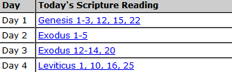
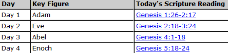
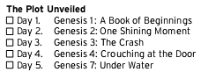
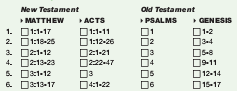
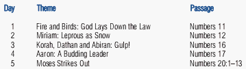
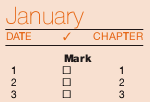

Here is a diverse and pretty comprehensive collection of Bible reading plans. All of them are easy to follow and most include a printable copy you can keep in your Bible.

They range from two week commitments to year-long commitments, from reading straight through cover to cover, to topical readings, to a mixture of readings each day.

Let me know in the comments if you know of any other good ones. And if you’re looking for the best pen for highlighting in your Bible, [check out my recommendation](https://www.alextran.org/the-best-pen-for-writing-notes-and-underlining-in-your-bible/).

**Click on an image to view the plan or download the PDF (if available).**

-   [Getting an Overview of the Bible](#overview)
-   [The Bible in a Year](#year)
-   [Short-Term Commitments](#short)
-   [New Testament Reading Plans](#nt)
-   [Sources and Other Reading Plans](#sources)

## Getting an Overview of the Bible

These plans do not go over every book/chapter of the Bible, however, they give the main people, topic and events of the Bible.

### 60 Day Overview

This one from Zondervan is nice because it doesn’t just give you the reading for the day, but also gives you the topic of what you’re reading. I consider that a nice cherry on top.

### Every Book in 61 Days

This reading plan walks you through key passages from every book of the Bible, from Genesis to Revelation, in just 61 days.

### Major Events and People in 61 Days

This reading plan introduces you to the major people and events of the Bible in chronological order, beginning with Creation, moving through the birth and history of the Israel nation, and ending with Revelation’s prophetic words.

### 90 Day Overview

Another one from Zondervan, this one goes a little more in-depth than the [60 day version](https://www.alextran.org/wp-content/uploads/2015/05/Zondervan_-_60_Day_Overview_of_the_Bible.pdf).

### 121 Days of People in the Bible

The advantages of this approach include ease in seeing the story of the Bible and becoming acquainted with the entire Who’s Who of the Bible.

### 180 Day Overview

The plan offers a kind of bird’s-eye-view. The daily readings consist of 180 selected passages, including at least one chapter from each of he Bible’s 66 books.

## The Bible in a Year

Here is a diverse collection of different reading plans that take you through the Bible in a year.

### Read by Genre

It divides up your reading into the main types of Genres (literature) such as Gospels, Law, Narrative (History), Psalms, Poetry, Prophecy, and Epistles!

### Read From 4 Separate Places

This plan gives you a good mix of reading an Old Testament book, a wisdom book and two New Testament books for each reading.

It is also structured well enough that you could shorten your reading for each day by focusing only on Old Testament, New Testament or some other variation.

Since you’ll have several “free days” each month, you could set aside Sundays either not to read at all or to catch up on any readings you may have missed in the past week.

### Read Two Books at a Time

Readings from two places in Scripture every day: an Old or New Testament book and one of the Old Testament wisdom books.

### Read from the Old/New Testaments, Psalms and Proverbs

The One Year Bible daily reading plan consist of passages from the Old Testament, New Testament, Psalms, and Proverbs.

Another option is this one created by [Scott Carlson](https://www.alextran.org/23-bible-reading-plans-that-will-satisfy-anyone/comment-page-3/#comment-238318) that has you read the the following each year:

-   1x Old Testament
-   2x New Testament
-   2x Psalms
-   4x Gospels
-   4x Proverbs

### Read from the Old and New Testament

This is a pretty straightforward plan starting from the beginning of the Old and New Testaments and working its way to the end.

### Robert Murray M’Cheyne’s Reading Plan

There are two types of readings in this plan: family and secret.

The family readings are meant for going over with your family, in groups or at a Bible study whereas the secret readings are for your own personal devotional time.

The problem with this is that there’s really no difference in the two types. You could just as easily read the secret readings in a group and vice versa. In fact, M’Cheyne even points this out when he [describes the plan](http://hippocampusextensions.com/mcheyneplan/).

So, \*shrug\*.

The whole Bible will be read through in an orderly manner in the course of a year. – The Old Testament once, the New Testament and Acts twice.

### Read in chronological order

This plan is based upon the historical research of scholars as it compiles readings according to the order that the events actually occurred.

### Read in the order each book was written

This plan is founded upon the research completed in regard to the dates each canonical book was authored. The books in the Hebrew and Greek Bibles are not in the same order as in our modern Bibles, and this plan restores that original ordering of the scriptures.

### Read from cover to cover

The classic plan. Start at Genesis and end in Revelations.

## Short-Term Commitments

These plans take no more than a month to complete and focus on a specific topic.

### 2 Week Guided Tour

This plan takes a look at various topics (eg. life of Jesus, teachings of Paul, the Old Testament, etc.) and condenses them each into two week courses.

There are 10, two week courses.

> This is a place to begin reading the Bible. These two-week reading courses take you quickly into passages every Christian should know. \[…\] they are frequently quoted or referred to elsewhere. Second, they are relatively easy to read and understand.

### 30 Days for New Christians

New to Christianity and never been through the Bible? This plans for you!

### 30 Days in the Psalms and Proverbs

Take 30 days to go through the main themes in the Psalms and another 30 days to go through all the Proverbs.

### 30 Days with Jesus

Consider this a short biography on Jesus. ;)

### 30 Stories You’ve Probably Never Heard

These are some interesting stories that help make the Old Testament a little more fun to read.

## New Testament Reading Plans

In case you find the Old Testament dry and boring, you can focus on the New Testament instead. Just be sure you go through the Old Testament sometime. ;)

### 5 Days a Week, 5 Minutes a Day

5 minutes per day, 5 days per week, 5 ways to dig deeper. Takes you through one chapter each day.

### With Psalms and Proverbs

Get the New Testament, Psalms and Proverbs in one year.

### New Testament in a Year

**Featured Download**: Didn’t find the type of plan you were looking for? I pulled together 46 PDF Bible reading plans into one easy download. [Download them now](http://bit.ly/2KRjwgZ).

## Sources and Other Reading Plans

-   [Bible Gateway](http://www.biblegateway.com/resources/readingplans/)
-   [One Year Bible Online](http://www.oneyearbibleonline.com/)
-   [Into Thy Word](http://www.intothyword.org/pages.asp?pageid=53493)
-   [Blue Letter Bible](http://www.blueletterbible.org/dailyreading/)
-   [Heartlight](http://www.heartlight.org/devotionals/reading_plans/)