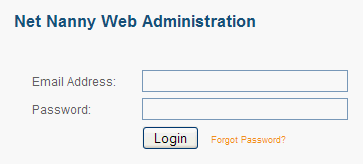
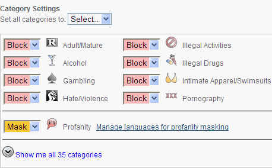

Christian guys look at porn. We search for pictures of naked chicks. We lust after attractive women.

Yup, it’s all true.

A main tool used by Christians to help counteract these temptations and sexual desires is an Internet filter. A program that filters what a person does online and blocks anything that seems shady.

But there are a gazillion different Internet filters out there. So which are the best ones?

The ones that consistently came up in reviews of Internet filters are [Net Nanny](http://www.netnanny.com), [CyberPatrol](http://www.cyberpatrol.com) and [Safe Eyes](http://www.safeeyes.com).

So which of the three should you use?

If you’re looking for a solid Internet filter to use within an accountability relationship, _Net Nanny (for Windows) is the hands down winner_.

Read on for why.

Please note this review is for the Windows version of Net Nanny. The Mac version is significantly different from the Windows version. Having used both, I can’t recommend the Mac version. Features are either missing from the Mac version or not as good as the Windows equivalent.

In addition to an Internet filter, I would also recommend you take advantage of these [simple and free ways to eliminate temptation](https://www.alextran.org/two-simple-and-free-ways-to-eliminate-porn-temptation/).

**What is an accountability relationship?**

An accountability relationship can mean a lot of things. In the context of this post it means Sean is accountable to Alex (that’s me!) for the websites he visits.

So I regularly monitor Sean’s browsing habits and respond accordingly. This helps remove the anonymity of browsing porn or other non-edifying websites.

Big brother Alex is always watching. ;)

### Why is Net Nanny the best Internet filter for accountability partners?

Here are the features that specifically make Net Nanny the best Internet filter to use in accountability relationships.

**Remote management**

Most accountability partners don’t live in the same house. Sean and I definitely don’t. I’m sure his wife is pretty happy about that. ;)

So being able to manage the Internet filter’s settings, view reports, etc. without physical access to the computer is a big win.

For example, Sean is at home trying to check out the resources at [XXXchurch](http://www.xxxchurch.com) (a legitimate site) and the filter blocks it. He can call and ask me to unblock the site.

With remote management, I can do that even though I’m at work and don’t have access to Sean’s computer. Without remote access, he would have to wait until I was able to access his computer physically. This is non-ideal and inconvenient for both of us.

And some accountability partners may not even be in the same city . . .

This makes remote management the _most_ important feature for accountability relationships.

While both Net Nanny and CyberPatrol have this feature, Safe Eyes does not.

I’ll note here CyberPatrol has two products: Online Protection and Parental Controls. This post refers to Online Protection since it _does_ include remote management and email notifications. Parental Controls does not.

**Usable, detailed reporting**

Guys on a mission to see some skin are extremely resourceful. They know 12 different ways to search for boobs.

Which means occasionally Sean may be able to get past the Internet filter and view an inappropriate site. This is where good, detailed reporting comes into play.

I can periodically look at the websites Sean has visited and see if there are any shady websites he was able to visit that didn’t get blocked. That let’s me manually block them so that he can’t visit them again.

The reporting in CyberPatrol is _horrible_. The only report it has shows just the number of allowed/blocked websites without details about which sites were allowed or blocked. How am I supposed to know if a site was allowed when it shouldn’t have been if I don’t know which sites were visited?

In contrast, the reporting in Net Nanny and Safe Eyes is detailed and useful. Above is just a small sampling of the reports available within Net Nanny.

**Notification of blocked sites**

Nothing will make Sean pee in his pants more in embarrassment than getting a phone call from me a few minutes after searching for naked pictures of Pamela Anderson and having the website blocked.

This works because the Internet filter sends me an email or text notification whenever Sean visits a blocked site.

Net Nanny, CyberPatrol and Safe Eyes all provide this feature, however, Net Nanny is by far the most flexible and customizable.

**Ability to request an override**

Inevitably a legitimate site will get filtered and blocked.

Providing a quick and easy way for Sean to let me know [XXXchurch](http://www.xxxchurch.com) is a legitimate site makes it easy for me to unblock it for him.

I don’t have to manually check for legitimate sites that are blocked and unblock them. And Sean doesn’t have to do any more work than clicking a button saying “I want this site unblocked.”

Net Nanny is the only filter that provides this feature.

**Not easy to bypass/disable**  
Remember how resourceful guys are on a mission? Some of the more tech-savvy guys may try various computer hacks to bypass the filter. A secure Internet filter needs to withstand these types of hacks and continue fighting the good fight even if shot in the arm/leg.

> Net Nanny has long had the unusual ability to filter even HTTPS traffic . . . None of Net Nanny’s competitors duplicate this feat, though Safe Eyes 6.0 comes close. The latest version of Net Nanny moves further into the lead because it also prevents the kids from using localhost proxy utilities to evade filtering.
> 
> Net Nanny resists a simple command-line instruction that disables some competing products, Safe Eyes and CyberPatrol 7.7 among them.  
> ~[Net Nanny 6.5 Review](http://www.pcmag.com/article2/0,2817,2360187,00.asp) (excerpt from section No Hope for Hackers)

In addition to the review above, I was recently skimming the Net Nanny forum and noticed a post detailing a way to bypass Net Nanny. In the next version this hack was disabled. It’s good to see this type of response to work-arounds . . .

### Further Research

-   [NetNanny 6.5 Review](http://www.pcmag.com/article2/0,2817,2360187,00.asp) (02/22/2010)
-   [Keep Your Child Safe Online](http://www.pcmag.com/article2/0,2817,2346997,00.asp) (03/01/2010)
-   [Internet Filter Software Review 2010](http://internet-filter-review.toptenreviews.com/index.html)

Internet filtering programs are constantly evolving, so be sure you’re comparing the latest of version each program.

As of this post, the latest versions are NetNanny 6.5, Safe Eyes 6.0 and CyberPatrol Online Protection 1.0.

How do you use Internet filters in an accountability relationship? What have you found effective?