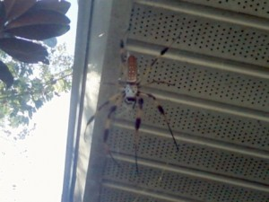

> **Job 9:5-9 (NIV)**  
> 5 He moves mountains without their knowing it  
> and overturns them in his anger.
> 
> 6 He shakes the earth from its place  
> and makes its pillars tremble.
> 
> 7 He speaks to the sun and it does not shine;  
> he seals off the light of the stars.
> 
> 8 He alone stretches out the heavens  
> and treads on the waves of the sea.
> 
> 9 He is the Maker of the Bear and Orion,  
> the Pleiades and the constellations of the south.

Sometimes in our quest for knowledge and answers, we explain God away and sideline him.  Moving mountains and earthquakes (v5-6) are understood by [fault lines](http://en.wikipedia.org/wiki/Geologic_fault).  Science (and Wikipedia!) give us all the answers.  [The Bear](http://en.wikipedia.org/wiki/Ursa_Major), [Orion](http://en.wikipedia.org/wiki/Orion_\(constellation\)) and [Pleiades](http://en.wikipedia.org/wiki/Pleiades_\(star_cluster\)) (v9) have their own Wikipedia article telling us everything we ever wanted to know about each constellation and its history.

But don’t forget how big and amazingly creative our God is. He is the creator of all the things that can be described, dissected and analyzed until we have all the answers.

What if you read these Wikipedia articles and instead of knowing them to be written by educated scientists in the field, you viewed them as written by God?

In a society of smart people, that is the one thing we \_can’t\_ forget.

> Dear Jesus,
> 
> I want to be able to soak and bask in the knowledge that you created the Heavens and the earth.  I want to stand in awe of your creation.  That the stars and sun in the sky are the work of your hands.  I want to forget about science and have that simplicity in understanding.
> 
> The cool, crisp winter breeze (does Florida have a winter breeze?).  The thick blades of grass that hurt to walk barefoot on.  The giant tree that I’m afraid will fall on my building at any time.
> 
> Those are yours.
> 
> I want to be able to smile from ear to ear when I see and experience your creation knowing you placed them there.
> 
> I want to forget adult etiquette and tell strangers how “awesome” and “cool” you are because you created the large and in charge banana spider by my mailbox.
> 
> For some reason God, I just want to have a grin on my face thinking about all this.

I laugh in the face of science! Hah!

