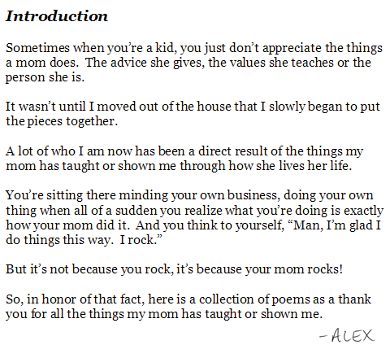
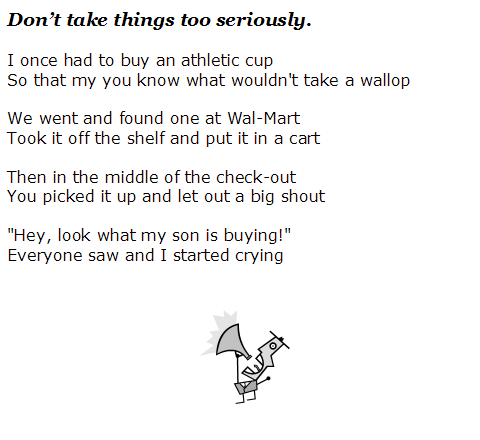
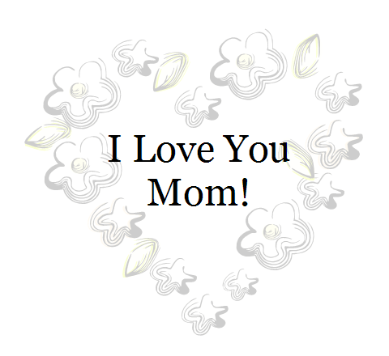

I was flipping through some of my old documents and ran across this collection of poems. I wrote them for my mom last year as a Christmas present.

Contrary to popular belief, I do occasional give Christmas presents. ;)

Each poem has a different rhyming scheme. I don’t remember which is which, but [Wikipedia was my source](http://en.wikipedia.org/wiki/Rhyme_scheme). ;)

