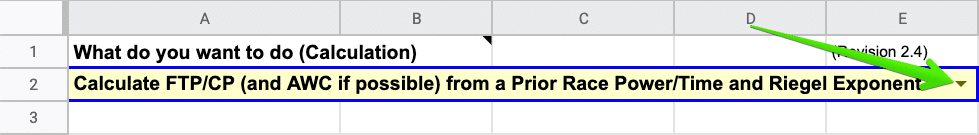
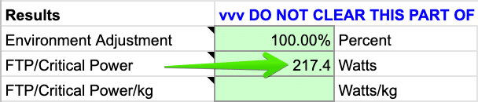
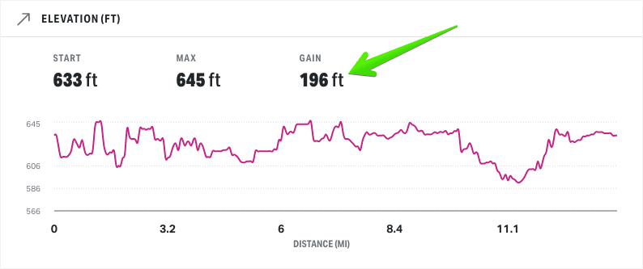
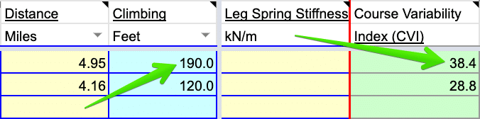

It all comes down to this: race day.

Everything you’ve done in training was to prepare you physically and mentally to show up on race day and perform your best. With the hard part complete, there’s one more thing you can do to boost your odds of executing well on race day.

I consider this the fun part: _Create a solid race plan_.

If there’s anywhere running with power outclasses pace-based running, it’s on race day. With some metrics only power-based running provides, you can craft a race strategy that:

-   Is perfectly tailored to your current fitness and unique running traits.
-   Provides a target range to work within the race.
-   Can accurately estimate finish time (even factoring in a course’s elevation profile).

Gone are the days of going out too fast only to crash and burn before the finish line, asking yourself, “Am I running too hard up this hill?”, or feeling like you had more in the tank at the end.

So, let’s start planning your race strategy!

> Remember, if you fail to prepare you are preparing to fail.
> 
> <cite>H.K. Williams</cite>

## Step 1: Calculate Your Current Critical Power (CP)

The key to accurate race planning is knowing your current [critical power](https://www.alextran.org/key-concepts/critical-power/) (i.e. your current fitness). That’s why it’s so important to do a [critical power test](https://www.alextran.org/key-concepts/critical-power-test/) 10-21 days before your target race. That timeframe is far enough out to let your body fully recover before race day yet close enough that it’ll be an accurate measure of race-day fitness. 

After the test, calculate your CP using the [SuperPower Calculator](https://www.alextran.org/superpower-calculator/) (SPC). Follow the instructions below depending on your test protocol (two-part test or race). 

### Calculate CP From a Two-Part Test

This could be any max effort test with two different durations (between 2 and 20 minutes for the highest reliability). Common test protocols include: 9/3 minute, 6/3 laps, or 3/10 minute.

#### Step 1a

In the `MAIN` sheet, choose `Calculate FTP/CP and AWC from 2 or more maximal effort Activities` from the calculation dropdown. 

#### Step 1b

Go to the `Activities` sheet. 

Under the `Power` and `Time` columns, enter the appropriate power and duration values for each segment. Make sure you also select the correct power and time units in the dropdown menus. 

#### Step 1c

Go back to the `MAIN` sheet and look take note of your `FTP/Critical Power` under the `Results` section. 

### Calculate CP From a Recent Race

This could be any race from a 5k up to a half marathon.

#### Step 1a

Make sure you’re on the `MAIN` sheet, and choose `Calculate FTP/CP (and AWC if possible) from a Prior Race Power/Time and Riegel Exponent` from the calculation dropdown. 

#### Step 1b

Enter your `Recent Race Avg Power` and `Recent Race Time` under the `Additional inputs` section, making sure you select the correct units for each field.

#### Step 1c

If you know your `Riegel Exponent` for this particular race distance, enter it now.

If not, change the `Riegel Exponent` dropdown from `Exponent` to `Lookup Riegel` and enter your `Recent Race Distance`.

You can also use the dropdown to select a standard race distance (e.g. 5k, 10k, half marathon, marathon).

#### Step 1d

Make note of the `FTP/Critical Power` number under the `Results` section. 

* * *

## Step 2: Check the Integrity of Your Calculated CP

Because everything rises and falls with the accuracy of your CP, it’s worth doing a few spot checks to see if the number calculated above is reliable enough to move forward with.

Here are some things to consider:

**Was the CP test or race performed at max effort and with sufficient rest beforehand (i.e. a mini taper)?**

If not, your calculated CP might be underestimated. If you have other recent CP tests, what CP values do those produce?

**How does your calculated CP compare to Stryd’s auto CP?**

Comparing your calculated CP to Stryd’s auto CP should only be done if your training block over the last 90 days includes the following:

-   Two max-effort durations between 2 and 20 minutes (similar to the durations prescribed in the typical two-part CP test).
-   A 5k or 10k race (at max or near max effort).

If you have those three data points then that drastically increases the accuracy of Stryd’s auto CP. In this situation, the auto CP value should be considered a reliable data point to compare to your calculated CP.

If you don’t have those three data points, you should ignore the auto CP value until you do.

**What does your previous training tell you about your calculated CP?**

Assuming you’re following a training plan with solid training principles, look at the faster-paced workouts you’ve done recently. How have those workouts felt? That gives you some insight on how your calculated CP should compare to your previous CP (used in workouts).

<table><tbody><tr><td><strong>Workout Power Targets</strong></td><td><strong>Previous CP</strong></td><td><strong>Calculated CP</strong></td></tr><tr><td>Hit easily</td><td>Probably underestimated</td><td>Should be greater than previous CP</td></tr><tr><td>Hit with moderate/hard effort</td><td>Probably on target</td><td>Should be near previous CP</td></tr><tr><td>Not hit regularly</td><td>Probably overestimated</td><td>Should be less than previous CP</td></tr></tbody></table>

For example, let’s say you’ve been hitting your power targets easily using your previous CP. Using the table above, that hints at your previous CP being underestimated. So your calculated CP should be higher than your previous.

Now, with all of this insight, it’s time to decide what CP value to move forward with.

Ideally, Stryd’s auto CP and/or multiple recent races (prioritizing those within 10-21 days of your target race) will converge on the same critical power or a narrow range (within 1%).

In that case, take the average and move forward with it.

If you find yourself with a wider range of critical power values, don’t be afraid to go with your gut. You know how your training has gone/felt. Does the lower or higher value feel more appropriate? Or does a number in between feel better?

Pick what feels right and go with it!

The beauty of training by power is that the more you run and race with it, the more accurate your numbers will get.

* * *

## Step 3: Calculate the Target Race’s Course Variability Index (CVI)

If you’re unfamiliar with CVI, [read this quick introduction](https://www.alextran.org/key-concepts/course-variability-index/).

Calculating your target race’s CVI is as simple as figuring out how much total elevation gain there is (in feet) and dividing it by race distance (in miles). Races will often link to a course map with that information.

If not, try searching [MapMyRun Routes](https://www.mapmyrun.com/routes/search) for the name of your race and see if there’s a matching route. Keep in mind, route elevation can be highly variable if taken from GPS data. Two different GPS devices might produce two different elevation profiles. To account for this, it’s best to look at multiple routes (if available) and use the average elevation gain.

Elevation gain from MapMyRun.

Worst case, if you can’t find the elevation gain (or don’t trust what you find), you can manually map the course yourself and figure it out. I like the tools provided by [Ride with GPS](https://ridewithgps.com) (the free account is enough).

Elevation gain from Ride with GPS.

Now that you have your race’s CVI, keep that number handy.

* * *

## Step 4: Estimate Your Race-Day Running Effectiveness (RE)

Knowing your [running effectiveness](https://www.alextran.org/key-concepts/running-effectiveness/) at target effort and adjusting it based on your target race’s CVI is a key component to accurate race planning.

### Step 4a

The first thing you’ll need to do is identify recent training segments or races (within the last six weeks) that satisfy the following requirements:

1.  Longer than 10 minutes at or around target race effort. Ideally longer and in a fatigued state (i.e. at the end of a workout or long run).
2.  Avoid net downhill segments (i.e. there’s more downhill running than uphill/flat).

Try to identify 2-3 suitable training segments or races.

If you can’t find anything satisfying #1 at target race effort, get as close as you can. For example, you can use marathon effort if needed for a half marathon race.

### Step 4b

For each segment identified above, you’re going to calculate RE using the SuperPower Calculator.

On the `MAIN` sheet, choose `Calculate Power metrics (RE, HPR, LSS/kg, CVI) for up to 10 completed Activities`.

### Step 4c

Enter your `Stryd Weight` (the value set in your Stryd profile).

### Step 4d

Click on the `Activities` sheet.

For each segment, enter the appropriate values under the `Power`, `Time`, and `Distance` columns. Make sure to choose the right units for each.

### Step 4e

The RE for each segment will be found under the `Running Effectiveness` column. You’ll need to scroll to the right to see it.

Chances are you’ll have differing values. This is expected since RE is affected by elevation gain/loss and each segment/race probably had varying levels of elevation.

You’ll compensate for that in this step. It’s also where things get a little more subjective.

You’re going to convert each RE value above into your best guess for race-day RE. To do that, use this lookup table to see how much to add or subtract from each segment’s RE.

On the bottom (x-axis), look for the column that corresponds to how hilly your training segment or previous race was. Then go up to the row (y-axis) that corresponds to your race CVI. The cell where the row and column intersect will be how much to add or subtract from the calculated RE value.

For example, let’s assume the segment in the screenshot above with an RE of 0.952 was done on a somewhat hilly course and my target race has a CVI of 80 (very hilly). Using the lookup table, I’d get -0.02 which means my estimated race-day RE would be 0.932 (0.952 – 0.02).

That makes sense since RE should decrease on hillier routes.

Do the same thing for other segments and average them to get your estimated RE on race day.

If your training or analytics platform supports showing elevation gain and distance for laps/splits or highlighted sections, you can make this step less subjective.

Instead of having to “guess” how hilly a segment was, use elevation gain (in feet) and distance (in miles) to calculate CVI for each segment and use that in the lookup. So if your training segment or previous race has a CVI of 30, you can start the lookup using `Slightly Hilly`.

If you know the elevation gain for the segments used above, you can use SPC to calculate CVI for you.

Enter the elevation gain for each segment under the `Climbing` column using the right unit of measure and then look at the `Course Variability Index (CVI)` column.

* * *

## Step 5: Adjust Critical Power for Environmental Conditions

One of the coolest thing the Stryd Team has released (and kindly allowed in the SuperPower Calculator) is a spreadsheet that takes a wattage value under one set of environmental conditions (temperature, humidity, and altitude) and converts it into the equivalent wattage under a different set.

This ensures you’re running at the same _effort_ despite different environmental conditions. This is particularly important if your target race will have drastically different conditions than your last CP test.

Even if conditions won’t be too different, it’s still a good practice to get used to adjusting for environmental conditions before each race.

Here’s how to do that …

### Step 5a

Go to the `MAIN` sheet then choose `Generate Race Power Scenarios using pairs of Riegel Exponents and RE` from the calculations dropdown.

### Step 5b

Enter your `Stryd Weight` and `FTP/CP` (calculated above) under the `Basic data` section.

### Step 5c

Under `Additional inputs`, specify the race’s `Target Distance`.

Use the dropdown to choose a common race distance or enter a custom distance using the appropriate distance unit (e.g. kilometers, miles, etc.).

### Step 5d

Scroll down to the `Environment Adjustments` section.

Enter the conditions for your last CP test under the `Typical Training ...` fields, making sure to specify the proper units for temperature and altitude.

For altitude, I generally look at what the min/max elevation was over the route and choose a number in the middle (often just using the starting altitude if there’s not much elevation change). It doesn’t need to be super precise, a ballpark elevation will do.

If you don’t know what the temperature and humidity were at your last CP test, you can use [Dark Sky](https://darksky.net/) and see if your location supports the Time Machine feature. Search for your address and scroll past the weekly forecast to see if the Time Machine button is available. If it is, you can go back to the day of your CP test and look at weather conditions at a specific time.

If you’re a Strava user, you can simplify this step in the future by using the [Klimat.app](https://klimat.app/) service. It automatically adds weather information after each run. Now whenever I need weather data for a run, I just check Strava.

### Step 5e

After entering conditions from your last CP test, do the same for race-day conditions in the `Target ...` fields.

It’s a good idea to do this step as close to race day as possible (like the night or day before). That way the weather forecast will be more accurate.

You should have something like this when you’re done:

### Step 5f

Next, go to the `Scenarios` sheet.

Notice your `FTP/CP` compared to your `Adjusted FTP/CP`. This adjusted value is what you’ll base your race targets off of.

In the example below, my CP of 222 is the equivalent of 229 under race conditions. That makes sense since race conditions were 30F cooler than my last CP test. I should be able to run faster at the same effort.

* * *

## Step 6: Determine Riegel Exponent Range

In addition to your CP and RE, you’ll use your [Riegel exponent](https://www.alextran.org/key-concepts/fatigue-factor/) (i.e. fatigue factor) to plan your race.

### Step 6a

Go back to the `MAIN` sheet and look under `Additional inputs`.

If you know your `Riegel Exponent` for your target race distance, enter it here and make sure the dropdown is set to `Exponent`.

If you don’t know your Riegel, change the `Exponent` dropdown to `Lookup Riegel` and input a `Recent Race Time` and `Recent Race Distance`. Ideally, choose a race with a similar distance to your target race.

The key here is entering a race time that represents your _current_ or _similar_ fitness. In order of preference, here’s what to use:

1.  A recent race time.
2.  A race within the last 6-12 months where fitness at the time is similar to current fitness.
3.  A _realistic_ expected finish time if no previous race data is available.

### Step 6b

If you used the `Riegel Lookup` option, scroll down to the `Results` section and make note of your `Riegel Exponent` value and `Exponent Range`. These are also shown in the `Scenarios` sheet which you’ll use next.

If you entered a specific Riegel exponent, your `Exponent Range` is one number above (+0.01) and below (-0.01) the number you entered.

* * *

## Step 7: Identify Target Race Power

This is where everything you’ve done so far will come together! Now you’re going to bracket possible race scenarios to get your target race power and a range to work within during the race (depending on how you feel).

### Step 7a

At the point, you have a Riegel range with three values.

Go to the `Scenarios` sheet.

Enter each of those values onto three separate rows under the `Riegel Exponent` column. And then copy/paste those three values two more times.

You’ll have three groups looking something like this:

### Step 7b

In the `Target RE` column, repeat your estimated race-day RE three times in the first group of Riegel exponents.

In the next second group, enter an RE value 0.01 lower than the first group. In the third group, enter an RE value 0.01 higher.

It should look similar to this:

### Step 7c

To estimate your target race power, we’re going to focus on the first group of three Riegel exponents. The lower and upper values found under `Avg Power` will be your target range during the race.

More specifically, look at the `Avg Power` for the middle Riegel exponent. You should start your race targeting that power. As the race progresses, adjust power up or down in the range (or even outside the range) depending on how you’re feeling.

In the example above, the target range is 217-220W with an initial target of 219W.

In a 5k or 10k, maintain your target power until halfway before deciding to increase or decrease power. In a half marathon, assess at 10k. In a full marathon, assess at 30k.

Also, take a look at the expected `Est Time` for your target range. It will give you an idea of expected finish time. Of course, this is contingent on your actual race RE. Look at the other RE groups to get a sense of finish time if your RE ends up being higher or lower than expected.

## Wrap Up

And there you have it.

You now have the exact wattage to target during your race. It’s based off your current fitness and expected race conditions, so go into your race confident! No need to worry about how to tackle the uphills and downhills, just focus on maintaining your target power.

Trust the plan. Trust the power. And the time will follow!