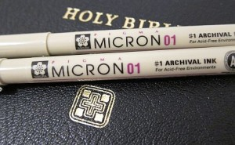

What is the best type of pen to use in a Bible?

I wish I would’ve asked that question earlier.

After trying highlighters, dry highlighters, pencils and pens (ball point, gelly, rollerball, etc.) without being satisfied with any for underlining and taking notes, I went on a quest to find the best pen.

The short answer: pigment ink (i.e. archive quality) pens.

Here are some of the key benefits:

-   **Minimal bleed-through** on thin paper (i.e. those used in Bibles)
-   **Extremely fine nib/tip sizes** (lets you write small while still being readable)
-   **Water proof** (accidental coffee spills anyone?)
-   **Quick drying** (great for left-handed people)
-   **Fade resistant** (you’ll still be able to read it 25 years from now)

Apparently the chemical properties of pigment ink allow it to dry on the surface of paper as opposed to soaking into the paper. That combined with the fine nib sizes minimizes how much your writing, highlighting/underlining is visible on the other side of the page.

Those are the two biggest wins when writing on very thin Bible paper. Oh, and the ability to write legibly in very tight margins. ?

These are some of the main pigment ink-based pens:

-   [Sakura of America Pigma Micron](/search/pigma-micron/)
-   [Prismacolor Premier Illustration Markers](/search/premier-illustration/)
-   [Staedtler Pigment Liner](/search/pigment-liner/)
-   [Copic Multiliner SP](/search/multiliner-sp/)

Of those pigment ink pens, the ones that were easiest to find at local arts and craft stores were the Pigma Micron and the Premier Illustration Markers.

They also seem to be the two most common online as well.

### My Experience

I went with the Pigma Microns because my local arts/craft store had a _sweet_ display with all the different colors/nib sizes available for individual purchase. So I was able to try them out beforehand and see which colors and nib sizes I preferred.

It was like being able to sample the different candies in a candy store!

Otherwise, you can buy them online.

One nice thing about the Pigma Micron pens is there are six nib sizes (line width) to choose from.

<table><thead><tr><th><strong>Nib Size</strong></th><th><strong>Width</strong></th></tr></thead><tbody><tr><td>005</td><td>0.2 mm</td></tr><tr><td>01</td><td>0.25 mm</td></tr><tr><td>02</td><td>0.30 mm</td></tr><tr><td>03</td><td>0.35 mm</td></tr><tr><td>05</td><td>0.45 mm</td></tr><tr><td>08</td><td>0.50 mm</td></tr></tbody></table>

Based on my tests, the best nib sizes to use for writing notes in your Bible are the 005, 01 or 02. The 03 would be fine for underlining but just a bit too thick for writing notes.

I prefer to write _and_ underline with one size (efficiency, baby!), so I chose a single nib size. I started with the 01, but eventually transitioned over to the smallest nib size (005).

I came to love how fine the tip was for writing and underlining.

The thinner nib also helps reduce what shows through on the opposite side of the page.

If you’re going with a thinner nib, I’d also recommend underlining in anything other than black. That way the color helps make the highlight stand out more.

### My Recommendation

I have been using a fine-tip Pentel R.S.V.P. pen for notes and underlines. While it has been decent, it _pales_ in comparison to the Pigma Micron.

Unlike the R.S.V.P., the Pigma Micron makes it _effortless_ to write small, legible characters and consistent underlines.

Being able to underline without the ink skipping brings a smile to my face. ?

If you’re going to give the Pigma Micron a try, here’s where I’d start:

-   [6 pens – Assorted Colors (005)](/go/pigma-micron-colors-005/) (I highly recommend that or the [01 version](/go/pigma-micron-colors/))
-   [6 pens – Black (all nib sizes)](/go/pigma-micron-black/)

Go with one or the other.

If you want color options and are confident in your nib size, go with the first one. If you’re uncertain on the nib size, go with the second. From there you can buy individual pens in bulk once you nail down your preferences!