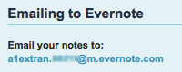
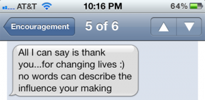

In my [previous post](https://www.alextran.org/2011/11/07/an-encouragement-folder-you-need-one/), I talked about maintaining an encouragement folder; a folder storing encouraging notes, emails, etc. reminding you of what you’re doing well and the impact you’re having.

In this post, I want to talk about creating a digital encouragement folder using a service called [Evernote](https://www.alextran.org/go/evernote/). It’s a service the lets you save and access information anywhere you have Internet access (e.g., a computer or smartphone).

Evernote’s tagline is “Remember everything.” Sounds perfect for those of us trying to remember encouraging things. ;)

Here are the features I appreciate about Evernote for maintaining my encouragement folder.

### Save Anything Via Email

This is probably the feature I use the most (particularly on my iPhone).

Every Evernote account comes with a private email address you can use to save information to. Anything you can send in an email, you can store in Evernote.

It’s perfect for capturing information while on the go!

For example, let’s say you get an encouraging text, simply take a screenshot of it and send it to your Evernote email address. It’ll magically appear in your account.

Receive an encouraging email? Forward it to your Evernote email!

**iPhone Tip:** Take a screenshot on your iPhone by pressing the Home and Power buttons at the same time. The screenshot will be saved in your Camera Roll.

### Digitize and Save Hand-Written Notes

Sometimes the most meaningful encouragement comes in the form of a hand-written note or letter.

What I love about Evernote is I can take a picture of the note/letter and store it in my Evernote account. The paper will never fade and I won’t ever have to worry about losing the note, spilling coffee on it, etc.

I’ve got a digital copy I can keep forever.

Not only that, but Evernote has an awesome feature that will make any text in the picture searchable.

So as I send notes, screenshots of text messages and other images with text into my encouragement folder, I can go back later and search for specific ones based on keyword.

Here I searched for “thank you” and Evernote brought up this hand-written note. It’s pretty stinkin’ legit. ;)

### Options, Options, Options!

With Evernote, there’s no shortage of options/tools for capturing, organizing and viewing your encouragement folder.

There’s a Mac/Windows version, a web clipper for clipping information in your browser and an app for virtually every type of smartphone.

I’ve also only covered a small part of what Evernote is capable of. I strongly recommend you check out their [website](http://www.evernote.com) and [blog](http://blog.evernote.com) for more ideas on how to use Evernote.

### One Folder to Rule Them All

Evernote is pretty much the bomb diggity. ;) It enhances the usage of an encouragement folder in so many ways.

You can keep track of every piece of digital and physical encouragement using a single tool. And everything is searchable and centrally accessible!

And using the vast number of options/tools provided by Evernote, it’s ridiculously easy to capture encouraging tidbits as soon as they happen. No excuses not to keep your folder up-to-date.

So the next time you need some encouragement, I hope you’ll fire up Evernote and read through some of the things in your  folder.

Where do you keep your encouragement folder now?

Do you use Evernote? What do you use it for?